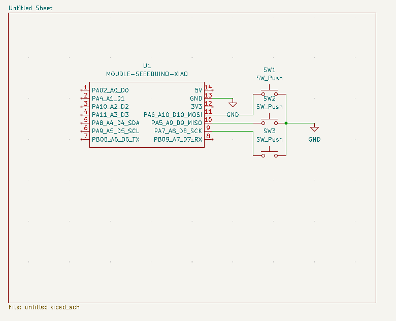
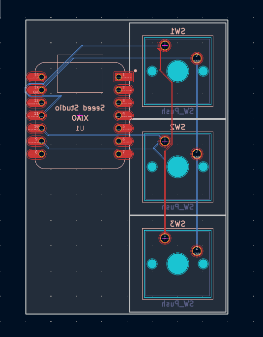
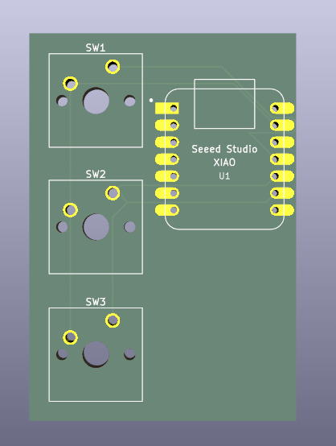
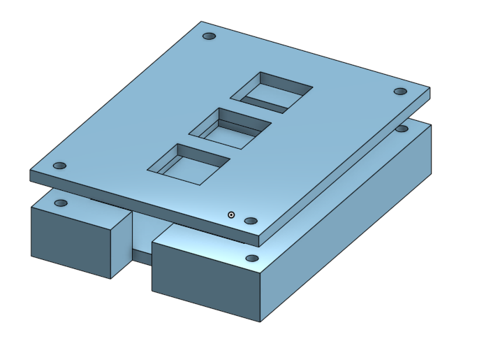

# Macropad

A simple 3-key macropad built with a Seeed XIAO RP2040, with default shortcuts copy, paste, and screenshot!

---

## Schematic

The schematic was designed in KiCad. Each switch is wired to a GPIO pin on the XIAO RP2040.

---

## PCB

The PCB was designed in KiCad. It uses a 2-layer board with the XIAO RP2040 on the back and switches on the front.

<!-- Replace with a screenshot of your PCB from KiCad -->

You can also view it in 3D:

<!-- Replace with a screenshot of the 3D viewer in KiCad -->

---

## Case

The case was designed in Onshape. It uses a sandwich-mount style with a bottom case and a top plate. (As shown in the Hackpad guide) 

<!-- Replace with a screenshot of your case from Onshape showing both parts -->

---

## Firmware

The firmware is written in KMK (a Python-based keyboard firmware). The keymap is configured in `Firmware/main.py`.

Default keymap:
| Key | Action |
|-----|--------|
| Key 1 | Copy (Ctrl+C) |
| Key 2 | Paste (Ctrl+V) |
| Key 3 | Screenshot (For Windows) |

---

## BOM (Bill of Materials)

| Part | Quantity | Purpose |
|------|----------|---------|
| Seeed XIAO RP2040 | 1 | Microcontroller |
| Cherry MX Switch | 3 | Keys |
| Keycaps | 3 | Key covers |
| M3 Screws | 4 | Case assembly |
| 3D Printed Case (bottom) | 1 | Bottom half of case |
| 3D Printed Plate (top) | 1 | Top plate |
| PCB | 1 | Main board |

---

